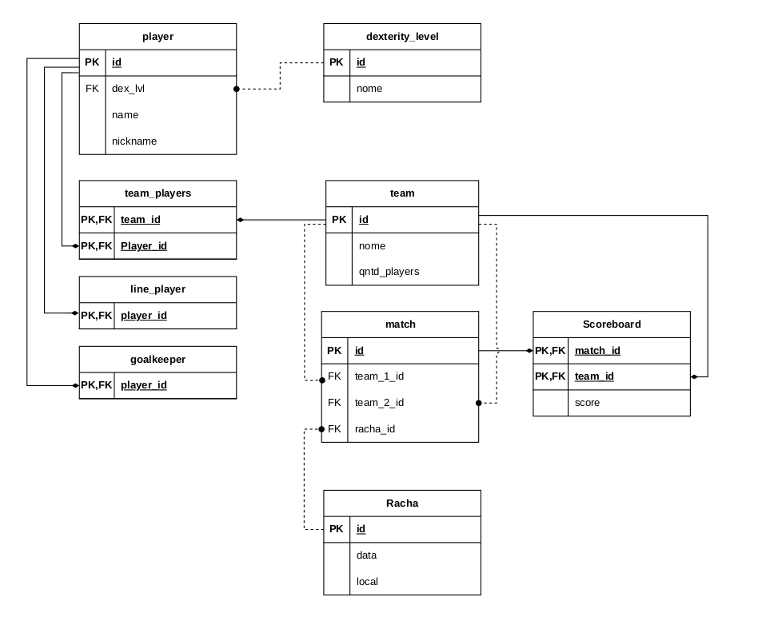

# ⚽️ Soccer Management System (Futebol UFC) README 📖

This README provides an overview of the Soccer Management System (Futebol UFC) project, including a description of the project, how to use it, and its structure.

## Table of Contents

- [Description](#Description%20📄)
- [Structure](#Structure%20🏗️)
- [Database](#Database%20📁)
- [Usage](#Usage%20🛠️)
- [Commands](#Commands%20💬)
- [Contributors](#Contributors%20👥)
- [License](#License%20📜)

## Description 📄

The Sistema de Gerenciamento de Times de Futebol, also known as Futebol UFC, is a project designed to manage soccer (football) teams and matches. This project provides functionalities for registering players, creating teams, organizing matches (rachas), and recording scores. It allows users to efficiently manage and track various aspects of a soccer league or tournament.

## Structure 🏗️

The project's structure is organized around several key classes:

- **Jogador**: Represents a player with attributes such as ID, name, nickname, and skill level.

- **Time**: Represents a soccer team with attributes including ID, name, the number of players, goalkeeper, and a list of players.

- **Racha**: Represents a soccer match (racha) with attributes like ID, date, and location.

- **SistemaFutebol**: This class serves as the core of the system, managing players, teams, rachas, and database operations.

- **InterfaceTerminal**: Provides a command-line interface for users to interact with the system by executing various commands.

## Database 📁

**Relational Diagram of the Database:**



## Usage 🛠️

To use the Sistema de Gerenciamento de Times de Futebol (Futebol UFC) project, follow these steps:

1. **Setup Instructions**:
   - Ensure you have Python installed on your system.
   - Ensure you have Sqlite3 installed on your system.
   - Ensure you have dataclasses python lib installed on your system.

1. **Installation**:
   - Clone or download the project from the GitHub repository.

1. **How to Run**:
   - Open a terminal or command prompt.
   - Navigate to the project directory.
   - Run the [racha.py](racha.py) script with Python:

     ```shell
     python3 racha.py
     ```

1. **Interact with the Project**:
   - Use the provided command-line interface to perform various actions, such as registering players, creating teams, and recording scores.
   - Refer to the available commands for detailed usage instructions.

1. **Review Output**:
   - The project will provide feedback and confirmation messages for actions you perform through the command-line interface.

## Commands 💬

The Sistema de Gerenciamento de Times de Futebol project supports the following commands:

- `cadastrar_jogador`: Register a new player with a name, nickname, and skill level.
- `atribuir_nivel`: Assign a new skill level to an existing player.
- `montar_racha`: Create a new soccer match (racha) with registered players.
- `registrar_placar`: Record the score for a racha.
- `listar_jogadores`: List all registered players.
- `listar_rachas`: List all registered rachas (soccer matches).
- `listar_times`: List all teams and their players.
- `deletar_racha`: Delete a racha based on its ID.
- `deletar_time`: Delete a team based on its ID.
- `deletar_jogador`: Delete a player based on their ID.
- `help`: Display a list of available commands and their descriptions.
- `quit`: Exit the program.

## Contributors 👥

- [JoseEdSouza](https://github.com/JoseEdSouza) 👋

## License 📜

This project is licensed under the MIT License. You can find detailed licensing information in the `LICENSE.md` file included in the project directory.
